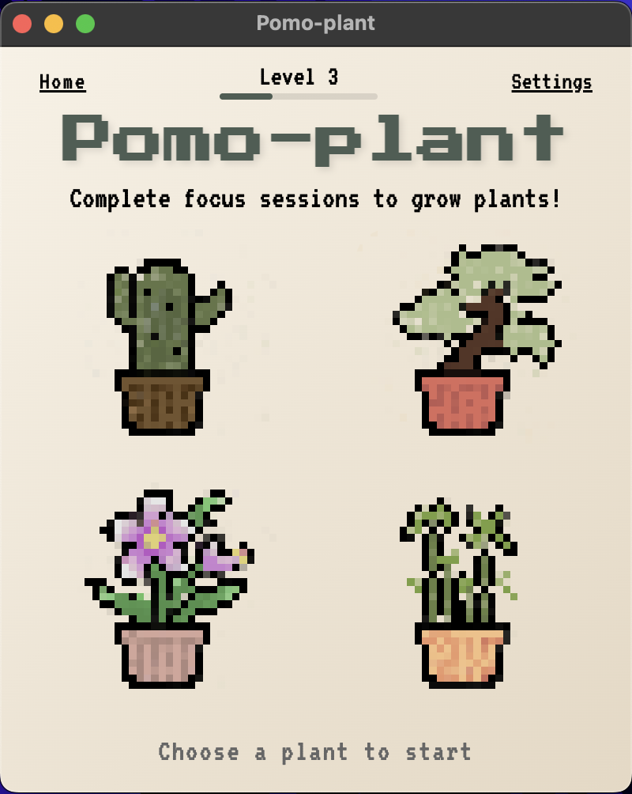
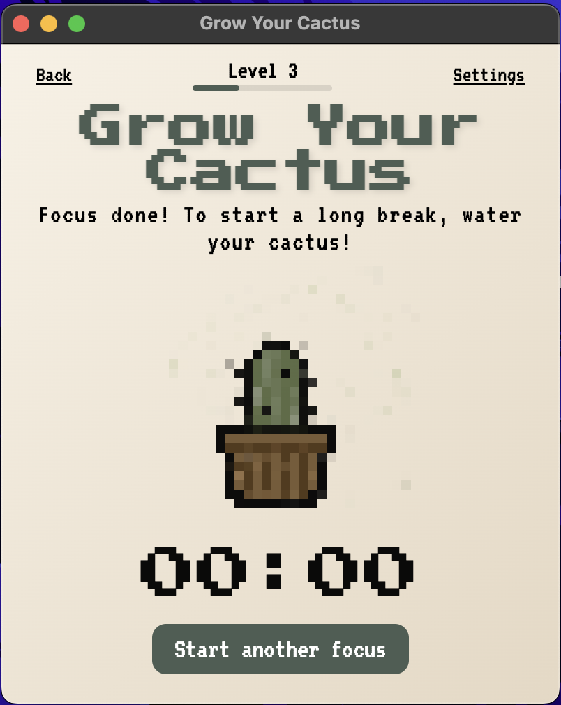
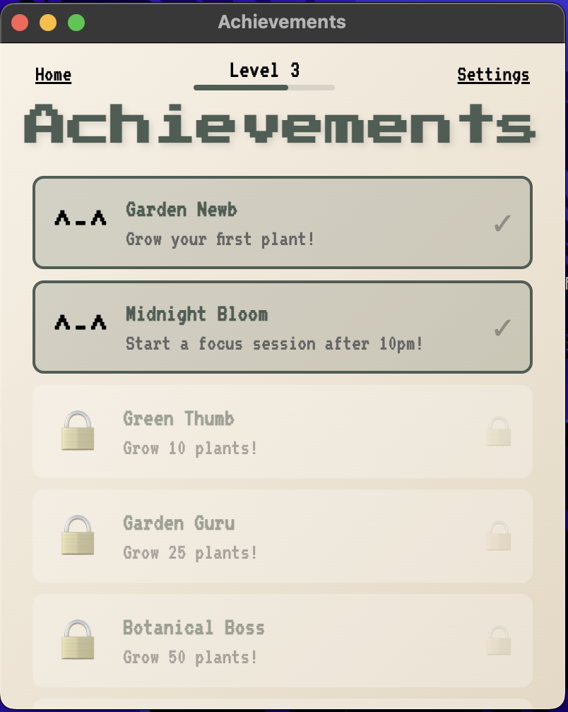

# pomoplant 

plant-growing pomodoro timer for macOS; grow digital plants by completing focus sessions and taking productive breaks.

  

## about

pomoplant combines the proven pomodoro technique with the satisfying progression of growing plants. complete focus sessions to water your plants and watch them grow through multiple stages. the more you focus, the more plants you'll grow!

## features

- **four plant types**: choose from cactus, bonsai, orchid, and bamboo
- **customizable timer settings**: customize focus, short break, and long break durations
- **visual plant growth**: watch your plants grow through multiple stages with hand-drawn pixel art animations
- **progress tracking**: level up system based on total plants grown
- **achievements**: unlock special achievements as you grow your garden
- **offline & persistent**: all data is stored locally; your progress never disappears

## download

### pre-built binaries

download the latest release DMG from [Latest Release](https://github.com/andygcui/pomoplant/releases/tag/v1.0.0)

1. download the DMG file for macOS
2. open the DMG file
3. drag Pomoplant to your Applications folder
4. run pomoplant from Applications (you may need to right-click and select "Open" on first launch)

### building from source

```bash
# Clone the repository
git clone https://github.com/yourusername/pomoplant.git
cd pomoplant

# Install dependencies
npm install

# Run the app in development
npm start

# Build for distribution
npm run dist
```

the built DMG will be in the `dist/` directory.

## how it works

1. **select a plant**: choose your plant type from the home screen
2. **start focus**: click "Start" and complete a focus session
3. **water your plant**: when the timer ends, click your plant to water it
4. **take breaks**: take short or long breaks between focus sessions
5. **watch it grow**: your plant progresses through stages as you complete sessions
6. **level up**: unlock achievements and track your total plants grown

## development

built with:
- Electron
- Vanilla JavaScript
- HTML/CSS

## License

MIT License
